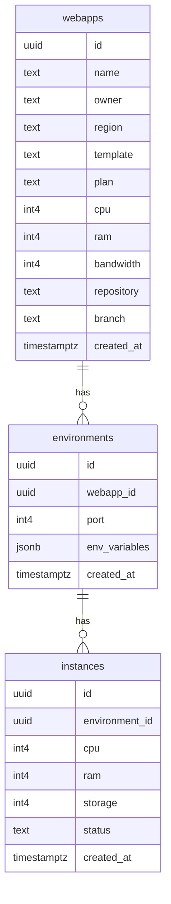
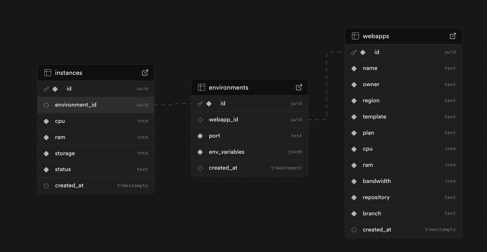

# WebApp Deployment Platform

## Goal
Build a platform to manage web application deployments, environments, and instances, supporting configuration, resource allocation, and environment variables for scalable, multi-tenant web apps.

---

## Tech Stack
- **Frontend:** React (TypeScript, Vite)
- **Styling:** Tailwind CSS, PostCSS
- **Backend/DB:** Supabase (PostgreSQL)
- **State Management:** React Context/State
- **Other:** ESLint, modern JS toolchain

---

## System Design & Approach

### Overview
- **Webapps:** Represents a user's web application project, including metadata, resource plans, and repository info.
- **Environments:** Each webapp can have multiple environments (e.g., dev, staging, prod), each with its own port and environment variables.
- **Instances:** Each environment can have multiple instances (e.g., for scaling), each with its own resource allocation and status.

### Data Flow
1. **User creates a Webapp** → defines name, owner, plan, repo, etc.
2. **User adds Environments** → each linked to a webapp, with port and env variables.
3. **Instances are provisioned** for each environment, with resource allocation and status tracking.

### Key Features
- Multi-environment support per webapp
- Resource allocation (CPU, RAM, Storage, Bandwidth)
- Environment variables per environment
- GitHub integration (repository, branch)
- Status and deployment tracking

---

## Entity Relationship Diagram

---

## Database Schema Screenshot

---

## Project Structure
- `src/components/` – UI components for forms, status, config, etc.
- `src/pages/` – Main pages: App setup, dashboard, deployments, environment config
- `src/lib/supabase.ts` – Supabase client setup
- `src/types/` – TypeScript types for entities

---

## How to Run
1. Install dependencies: `npm install`
2. Start dev server: `npm run dev`
3. Configure Supabase and environment variables as needed

---

## Contributing
Pull requests and issues welcome! Please follow code style and add tests where possible. 